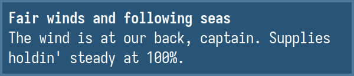

# upower-notify

A lightweight, configurable battery monitor. It listens to UPower events via D-Bus and sends desktop notifications or executes commands when battery levels change.



## Features

- Configurable: Customize notification text, icons, urgency, and timeouts.
- Scriptable: Run custom commands (e.g., `mpv notify.ogg`) on specific events.

## Runtime Requirements

- `upower`
- A notification server (e.g., `dunst`, `mako`)

## Installation

```bash
git clone https://github.com/Guanran928/upower-notify.git
cd upower-notify
cargo install --path .
```

## License

MIT
